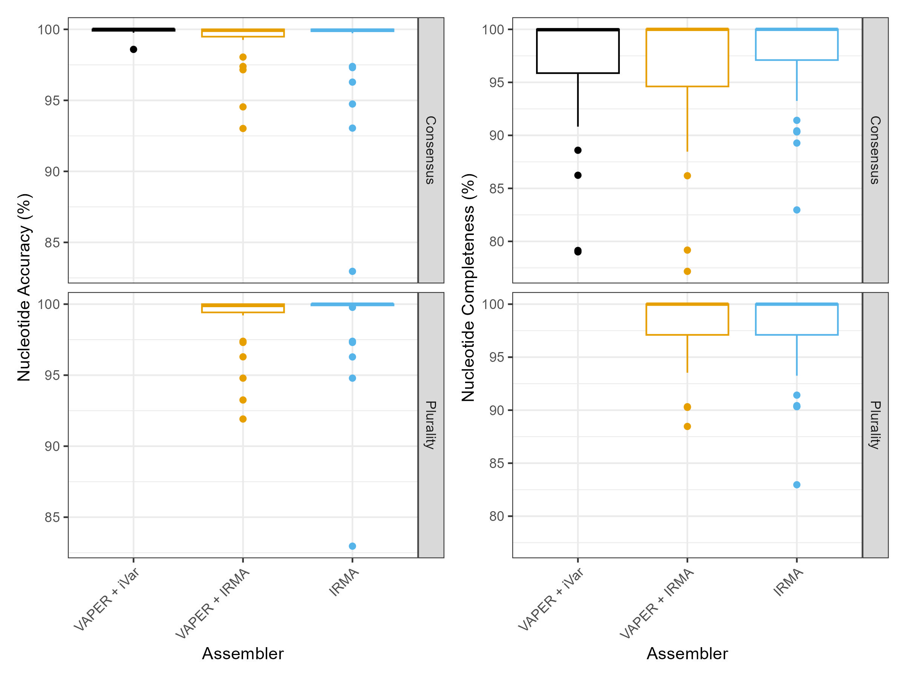

# **Example:** {{ page.title }}

The accuracy and completeness of iVar and IRMA assemblies were determined for 6 virus species (`Alphainfluenzavirus influenzae`, `Betainfluenzavirus influenzae`, `Mobillivirus hominis`, `Orthorubulavirus parotitidis`, `Severe acute respiratory syndrome coronavirus 2`, and `Enterovirus D`) using Illumina hybrid capture data generated from 7 Twist Bioscience synthetic DNA controls (controls `2`, `4`, `5`, `6`, `15`, `17`, and `66`). Multiple replicates of controls `5`, `15`, and `17` were included. Assembly accuracy and completeness were calculated using the scripts located [here](https://github.com/DOH-JDJ0303/vaper/tree/main/bin/aux/validation).

## VAPER + iVar vs VAPER + IRMA

Assemblies were created from each synthetic control using VAPER with the `EPITOME_2025-02-14` reference set with the following conditions:
* iVar: `--cons_assembler ivar --cons_assembly_type consensus`
* IRMA (Consensus): `--cons_assembler irma --cons_assembly_type consensus`
* IRMA (Consensus + Elongation): `--cons_assembler irma --cons_assembly_elong true`
* IRMA (Plurality): `--cons_assembler irma --cons_assembly_type plurality`

## VAPER vs IRMA FLU

Assemblies were created from Twist Bioscience synthetic controls 4 and 17, using either VAPER and the `EPITOME_2025-02-14` references or using the standard IRMA FLU module:
* VAPER + iVar: `--cons_assembler ivar --cons_assembly_type consensus`
* VAPER + IRMA (Consensus): `--cons_assembler irma --cons_assembly_type consensus`
* VAPER + IRMA (Plurality): `--cons_assembler irma --cons_assembly_type plurality`
* IRMA (Consensus / Plurality): `IRMA FLU --external-config <config> <read1> <read2> <outdir>`
{: .note}
The minimum read length was adjusted to 75 bp for 3 of the 4 technical replicates of control 17, using the `--external-config` parameter when running the standard IRMA module.
