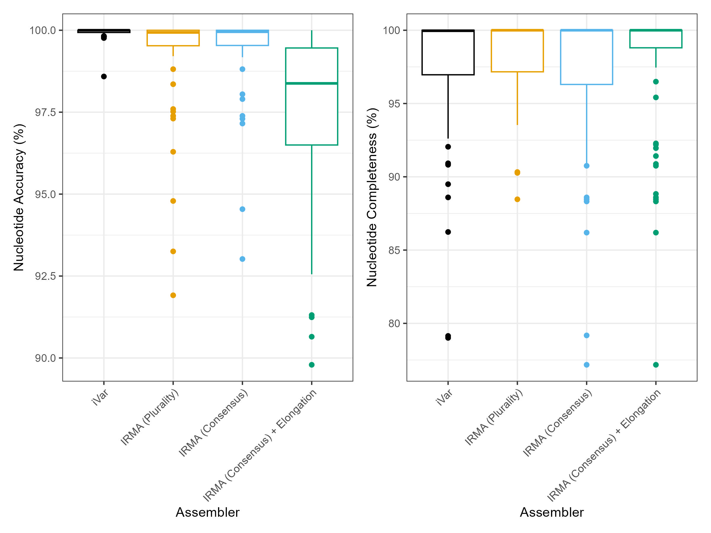

# **{{ page.title }}**
{: .no_toc }

1. TOC
{:toc}

# **Flowchart**


# **Prepare Inputs**
VAPER performs basic quality control on the reads prior to reference selection and genome assembly. VAPER does not quality control the references.

## Read Quality
Read quality is evaluated and managed using `FastQC` and `fastp`. Fastp metrics are reported in the final summary. FastQC metrics can be found in the `MultiQC` report.

## Read Downsampling
Reads can be optionally downsampled prior to read quality using the `--max_reads` parameter (default: `2000000` reads). This is accomplished using `seqtk sample`.

## Downloading Reads from SRA
VAPER can download reads automatically from the NCBI Sequence Read Archive (SRA) (see example below).
{: .note}
These must be paired-end Illumina reads.

`samplesheet.csv`
```
sample,sra
sample01,SRR28460430
```

# **Reference Selection**
VAPER can automatically select references for you and/or you can tell VAPER which references to use.
 
## Automated Reference Selection
VAPER comes with multiple automated reference selection modes (`--refs_mode ( accurate | fast | kitchen-sink )`). `accurate` and `fast` modes use a _reference set_ supplied using the `--refs` parameter (more details below). `kitchen-sink` mode downloads references from NCBI using the metagenomic summary.

### `accurate` mode
As the name implies, reference selection using `accurate` mode is _more accurate_ but _slower_. References are selected by mapping contigs from a de novo assembly to the entire reference set using `minimap2 -x asm5 --secondary=no`. The `-x asm5` flag means that contigs will only map to references that share approx. 95% nucleotide identity. The `--secondary=no` flag means that contigs will only map to the closest matching reference (no multi-mapping). Together, these parameters allow VAPER to choose reference(s) that best match the sample. Tweaking the parameters below may improve results if you run into any issues:

* `--ref_genfrac`: controls the minimum percent of a reference that must be mapped by one or more de novo contig for it to be selected for consensus generation.
* `--denovo_assembler`: controls which tool is used for de novo assembly. Options include `megahit`, `spades`, `velvet`, and `skesa`.
* `--denovo_contigcov`: controls the minimum coverage required for a contig to be included in the de novo assembly.
* `--denovo_contiglen`: controls the minimum contig length required for a contig to be included in the de novo assembly.

### `fast` mode
Also aptly named, `fast` mode is _faster_ but _less accurate_ (how much faster is up for debate). This approach uses `sourmash gather` to determine which reference(s) in the reference set are best represented in the raw reads. This mode has not been thoroughly tested. You can adjust this primarily using the `--ref_genfrac` parameter.

### `kitchen-sink` mode 🚽 
`kitchen-sink` mode attempts to build assemblies for each taxon identified in the metagenomic summary. Genome assemblies associated with each taxon are downloaded from NCBI using the NCBI `datasets` tool. Only assemblies that are listed as _complete_ are included. Assemblies containing multiple contigs are split into individual FASTA files to avoid concatenating segmented viruses. As you can imagine, this method of reference selection can be very unreliable and should therefore be used with caution ⚠️.

## Manual Reference Selection
You can tell VAPER which reference(s) to use for each sample by supplying a file path and/or the name of a reference in a reference set. This information is included in the `references` column of the samplesheet for each sample (see the examples below).

### *Example:* File path

`samplesheet.csv:`
```
sample,fastq_1,fastq_2,reference
sample01,sample01_R1.fastq.gz,sample01_R2.fastq.gz,/path/to/ref.fa.gz
```
### *Example:* Reference name
The example below would match reference `Betacoronavirus-wg-1.fa.gz` in the default reference set.

`samplesheet.csv:`
```
sample,fastq_1,fastq_2,reference
sample01,sample01_R1.fastq.gz,sample01_R2.fastq.gz,Betacoronavirus-wg-1
``` 
### *Example:* Multiple references
Multiple references can be supplied for each sample using a semi-colin (`;`). You can supply file paths and reference names at the same time 🙌!

`samplesheet.csv:`
```
sample,fastq_1,fastq_2,reference
sample01,sample01_R1.fastq.gz,sample01_R2.fastq.gz,Betacoronavirus-wg-1;/path/to/ref.fa.gz
```

# **Reference Sets**
VAPER can automatically select references from a _reference set_ (specified using the `--refs` parameter).

## Creating Reference sets
### The Refsheet
The _refsheet_ is a comma-separated file containing the paths to each reference assembly file (like a _samplesheet_ but for references 😬). Information about each reference (e.g., species, segment, creation date, source, etc.,) can be supplied by adding extra columns to the _refsheet_ (this is totally optional - name the columns whatever you want!). This extra info will be copied into the `VAPER-summary.csv` each time the reference genome is used.

Below is an example of what a `refsheet` looks like:

`refsheet.csv`
```
assembly,taxon,segment
Influenza_A_HA.fa.gz,Alphainfluenzavirus,4
Monkeypox_virus_wg.fa.gz,Orthopoxvirus,wg
```
### Creating a compressed reference set
VAPER also accepts compressed reference sets (`tar.gz` files) that contain both the _refsheet_ and the reference assemblies. This is ideal if you plan to share the references. Take a look at the [default reference set](https://github.com/DOH-JDJ0303/vaper/tree/main/assets/reference_sets) to learn more.

## The Default Reference Set
VAPER comes with a default reference set that includes multiple viral species (see table below; files located in `vaper/assets/reference_sets/`). This set includes information about the sequences that were used to create each reference (if you are confused, go read about [EPITOME](https://github.com/DOH-JDJ0303/epitome)). A brief summary of this information is shown below.

|Taxon               |Segments  | No. References|No. Species | No. Input Sequences|
|:-------------------|:---------|--------------:|:-----------|-------------------:|
|Alphacoronavirus    |wg        |            204|66          |                1104|
|Alphainfluenzavirus |1 - 8     |           1921|1           |              416440|
|Betacoronavirus     |wg        |            135|53          |                3436|
|Betainfluenzavirus  |1 - 8     |             45|1           |              110948|
|Bocaparvovirus      |wg        |             94|48          |                 574|
|Enterovirus         |wg        |           1782|26          |                5870|
|Hantavirus          |[l; m; s] |            227|31          |                 762|
|Hepacivirus         |wg        |            790|42          |                 959|
|Hepatovirus         |wg        |             56|14          |                 110|
|Lyssavirus          |wg        |            197|23          |                2532|
|Mastadenovirus      |wg        |            115|69          |                1339|
|Metapneumovirus     |wg        |             24|3           |                 380|
|Morbillivirus       |wg        |             87|14          |                1075|
|Norovirus           |wg        |            245|5           |                 947|
|Orthoflavivirus     |wg        |            371|83          |                6657|
|Orthopneumovirus    |wg        |             18|4           |               17121|
|Orthopoxvirus       |wg        |             14|11          |                7247|
|Orthorubulavirus    |wg        |             28|9           |                1052|
|Respirovirus        |wg        |             43|16          |                 549|

{: .note}
This reference set was created using [EPITOME](https://github.com/DOH-JDJ0303/epitome) with a 2% divergence threshold. The divergence threshold was selected based on work conducted using [varcraft](https://github.com/DOH-HNH0303/varcraft), which found that assembly quality tends to drop-off when sample-reference divergence exceeds 5%.

{: .important}
The EPITOME references come with a plethora of information associated with each input sequence that was used to create the reference. These includes fields like `SPECIES`, `COLLECTIONDATE`, `GEOGRAPHICREGION`, and `SEROTYPE`. Given that this data comes from a public sequencing repo, we cannot vouch for its validity. Please interpret with caution ⚠️!

# **Genome Assembly**
VAPER creates genome assemblies by aligning reads to a reference genome and calling the consensus or plurality at each reference position (default: consensus). This can be accomplished using either `ivar` or `irma` (default: `--cons_assembler ivar`).

{: .note}
The de novo assembly used for ‘accurate’ reference selection is not used in the final reference-based assembly.

## Assembly Parameters
Learn more about how to adjust assembly parameters [here](inputs.html#assembly-options).

{: .tip}
You can fine tune your IRMA assembly by adjusting the multitude of parameters located here: `assets/IRMA_MODULE/init.sh`. This file will be automatically copied into the work directory and used to build the IRMA module. However, `MIN_AMBIG`, `MIN_CONS_SUPPORT`, `MIN_CONS_QUALITY`, and `SKIP_E` must be adjusted from the command line using `--cons_allele_ratio`, `--cons_allele_depth`, `--cons_allele_qual`, and `--cons_assembly_elong`, respectively.

## Assembly Quality
Assembly quality is evaluated using Nextclade and custom scripts. Quality metrics are reported relative to the reference genome used to create the assembly. Assemblies are automatically classified as `PASS` or `FAIL` based on the QC thresholds set using the `--qc_depth` and `--qc_genfrac` parameters. Assemblies will still be saved if they fail QC!

{: .note}
VAPER reports the number of bases in the sample missing from the termini of the reference in a separate column (`ASSEMBLY_TERMINI_GAPS`) because this is not included in the missing bases count by Nextclade.

## Genome Assemblers
### `ivar` assembler
iVar is the default assembler used by VAPER. Reads are aligned to the reference genome using BWA MEM and the alignment pileup is passed to `ivar` for consensus generation.

### `irma` assembler
IRMA is a CDC-developed viral assembler with some nifty features 🌼. The main selling point with IRMA is that it can iteratively adjust the reference genome to more closely match the sample reads, therefore resulting in a more _accurate_ assembly. This is accomplished using a liberal initial read alignment approach that allows for greater sample-reference divergence. IRMA can also elongate the reference during the refinement process, ideally resulting in a more "complete" assembly (`--cons_elong true`; use with caution ⚠️). Out of the box, IRMA is limited to a select number of species: influenza, ebolavirus, and coronavirus. This is because IRMA requires species-specific "modules" that contain a defined set of reference genomes. We can get around this by building these modules on the fly using the VAPER references 😎.

Another important difference with IRMA is that is produces multiple different assembly types, including a `consensus` assembly, like iVar, along with a `plurality` assembly and a `padded` assembly. Each have their own considerations (read more [here](https://wonder.cdc.gov/amd/flu/irma/consensus.html)). VAPER returns the `consensus` assembly by default (`--cons_assembly_type consensus`).

### iVar vs IRMA
The accuracy and completeness of iVar and IRMA assemblies were determined for 6 virus species (`Alphainfluenzavirus influenzae`, `Betainfluenzavirus influenzae`, `Mobillivirus hominis`, `Orthorubulavirus parotitidis`, `Severe acute respiratory syndrome coronavirus 2`, and `Enterovirus D`) using Illumina hybrid capture data generated from 7 Twist Bioscience synthetic DNA controls (controls `2`, `4`, `5`, `6`, `15`, `17`, and `66`). Multiple replicates of controls `5`, `15`, and `17` were included. Assembly accuracy and completeness were calculated using the scripts located [here](https://github.com/DOH-JDJ0303/vaper/tree/main/bin/aux/validation).

#### `VAPER + iVar` vs `VAPER + IRMA`

Assemblies were created from each synthetic control using VAPER with the `EPITOME_2025-02-14` reference set with the following conditions:
* iVar: `--cons_assembler ivar --cons_assembly_type consensus`
* IRMA (Consensus): `--cons_assembler irma --cons_assembly_type consensus`
* IRMA (Consensus + Elongation): `--cons_assembler irma --cons_assembly_elong true`
* IRMA (Plurality): `--cons_assembler irma --cons_assembly_type plurality`

#### `VAPER` vs `IRMA FLU`

Assemblies were created from Twist Bioscience synthetic controls 4 and 17, using either VAPER and the `EPITOME_2025-02-14` references or using the standard IRMA FLU module:
* VAPER + iVar: `--cons_assembler ivar --cons_assembly_type consensus`
* VAPER + IRMA (Consensus): `--cons_assembler irma --cons_assembly_type consensus`
* VAPER + IRMA (Plurality): `--cons_assembler irma --cons_assembly_type plurality`
* IRMA (Consensus / Plurality): `IRMA FLU --external-config <config> <read1> <read2> <outdir>`
{: .note}
The minimum read length was adjusted to 75 bp for 3 of the 4 technical replicates of control 17, using the `--external-config` parameter when running the standard IRMA module.

# **Metagenomic Classification**
VAPER performs a basic viral _metagenomic_ analysis using `sourmash gather` and `sourmash tax metagenome` with the [21-mer viral GenBank database](https://sourmash.readthedocs.io/en/latest/databases.html#genbank-viral). You can supply alternative database files using `--sm_db` and `--sm_taxa`.

{: .note}
- The static image and summary exclude unclassified sequences when calculating relative abundance. Sequences with relative abundance ≤ 1% are grouped into `Other`.
-  The term _metagenomic_ is used liberally here. A better term would probably be a _metaviromic_ analysis, as it only includes viral species.

## Example Outputs
Below are examples of the metagenomic output for a Twist Bioscience synthetic RNA control for Influenza A H1N1.
### Krona Plot

Download the interactive plot [here](../media/metagenomics.krona_example.html).

### Static Image


### VAPER Summary
|SPECIES_SUMMARY|
|:-|
|91.2% Influenza A virus; 6.4% Escherichia virus P1; 6.4% uncultured human fecal virus|


