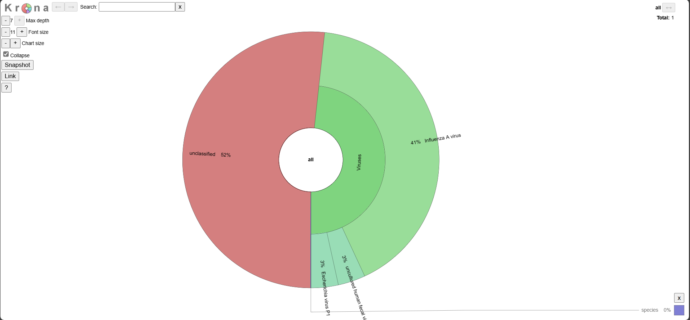

# {{ page.title }}
{: .no_toc }

1. TOC
{:toc}

# What is VAPER?
## Flowchart


## Key Features
VAPER (<ins>V</ins>iral <ins>A</ins>ssembly from <ins>P</ins>robe-based <ins>E</ins>n<ins>r</ins>ichment) is a viral (meta-)assembly pipeline that can:

<div style="padding: 1em; margin: 1em 0;">
🧬 Assemble genomes from complex samples, supporting multiple assemblies per sample (e.g., co-infections)<br>
🧬 Automatically detect and select reference genomes<br>
🧬 Predict the taxonomy of each assembly, with an optional viral metagenomic summary<br>
🧬 Export reads associated with each assembly for downstream use<br>
</div>

While VAPER was originally designed for hybrid capture data (e.g., [Illumina VSP](https://www.illumina.com/products/by-type/sequencing-kits/library-prep-kits/viral-surveillance-panel.html) or [Twist CVRP](https://www.twistbioscience.com/products/ngs/fixed-panels/comprehensive-viral-research-panel)), it has also been used with shotgun metagenomic and tile-amplicon data. It comes stock with comprehensive reference sets for <span id="taxon-count">[loading]</span> taxa, including influenza A, SARS-CoV-2, and Monkeypox ([full list](../../ref_search/)). Keep on reading to learn more!

## Contributors
VAPER was originally created by the Washington State Department of Health (WA DOH) as part of the Pathogen Genomics Center of Excellence (PGCoE). Check out the links below to learn more:
- [VAPER developers](https://github.com/DOH-JDJ0303/vaper/graphs/contributors)
- [Other contributors](https://github.com/DOH-JDJ0303/vaper?tab=readme-ov-file#acknowledgements)
- [NW PGCoE](https://nwpage.org/)

# Inputs
VAPER performs basic quality control on the reads prior to reference selection and genome assembly. VAPER **does not** perform QC on supplied references.

## Read Quality
Read quality is evaluated and managed using `FastQC` and `fastp`. Fastp metrics are reported in the final summary. FastQC metrics can be found in the `MultiQC` report.

## Read Downsampling
Reads can be optionally downsampled prior to read quality using the `--max_reads` parameter (default: `2000000` reads). This is accomplished using `seqtk sample`.

## Downloading Reads from SRA
VAPER can download reads automatically from the NCBI Sequence Read Archive (SRA) (see example below).

`samplesheet.csv`
```
sample,sra
sample01,SRR28460430
```

{: .note}
These must be paired-end Illumina reads.

# Reference Selection
VAPER can automatically select references for you and/or you can tell VAPER which references to use.
 
## Automated Reference Selection
VAPER comes with multiple automated reference selection modes (`--refs_mode ( accurate | fast | kitchen-sink )`). `accurate` and `fast` modes use a _reference set_ supplied using the `--refs` parameter. `kitchen-sink` mode downloads references from NCBI using the metagenomic summary.

{: .note}
Learn more about how reference sets are created [here](../../developers/reference_sets/)

### `accurate` mode
As the name implies, reference selection using `accurate` mode is _more accurate_ but _slower_. References are selected by mapping contigs from a de novo assembly to the entire reference set using `minimap2 -x asm5 --secondary=no`. The `-x asm5` flag means that contigs will only map to references that share approx. 95% nucleotide identity. The `--secondary=no` flag means that contigs will only map to the closest matching reference (no multi-mapping). Together, these parameters allow VAPER to choose reference(s) that best match the sample. Tweaking the parameters below may improve results if you run into any issues:

* `--ref_genfrac`: controls the minimum percent of a reference that must be mapped by one or more de novo contig for it to be selected for consensus generation.
* `--denovo_assembler`: controls which tool is used for de novo assembly. Options include `megahit`, `spades`, `velvet`, and `skesa`.
* `--denovo_contigcov`: controls the minimum coverage required for a contig to be included in the de novo assembly.
* `--denovo_contiglen`: controls the minimum contig length required for a contig to be included in the de novo assembly.

### `fast` mode
Also aptly named, `fast` mode is _faster_ but _less accurate_ (how much faster is up for debate). This approach uses `sourmash gather` to determine which reference(s) in the reference set are best represented in the raw reads. This mode has not been thoroughly tested. You can adjust this primarily using the `--ref_genfrac` parameter.

### `kitchen-sink` mode 🚽 
`kitchen-sink` mode attempts to build assemblies for each taxon identified in the metagenomic summary. Genome assemblies associated with each taxon are downloaded from NCBI using the NCBI `datasets` tool. Only assemblies that are listed as _complete_ are included. Assemblies containing multiple contigs are split into individual FASTA files to avoid concatenating segmented viruses. As you can imagine, this method of reference selection can be very unreliable and should therefore be used with caution ⚠️.

## Manual Reference Selection
You can tell VAPER which reference(s) to use for each sample by supplying a file path and/or the name of a reference in a reference set. This information is included in the `references` column of the samplesheet for each sample (see the examples below).

### *Example:* File path

`samplesheet.csv:`
```
sample,fastq_1,fastq_2,reference
sample01,sample01_R1.fastq.gz,sample01_R2.fastq.gz,/path/to/ref.fa.gz
```
### *Example:* Reference name
The example below would match reference `Betacoronavirus-wg-1.fa.gz` in the default reference set.

`samplesheet.csv:`
```
sample,fastq_1,fastq_2,reference
sample01,sample01_R1.fastq.gz,sample01_R2.fastq.gz,Betacoronavirus-wg-1
``` 
### *Example:* Multiple references
Multiple references can be supplied for each sample using a semicolon (`;`). You can supply file paths and reference names at the same time 🙌!

`samplesheet.csv:`
```
sample,fastq_1,fastq_2,reference
sample01,sample01_R1.fastq.gz,sample01_R2.fastq.gz,Betacoronavirus-wg-1;/path/to/ref.fa.gz
```

# Genome Assembly
VAPER creates genome assemblies by aligning reads to a reference genome and calling the consensus or plurality at each reference position (default: consensus). This can be accomplished using either `ivar` or `irma` (default: `--cons_assembler ivar`).

{: .note}
The de novo assembly used for ‘accurate’ reference selection is not used in the final reference-based assembly.

## Assembly Parameters
Learn more about how to adjust assembly parameters [here](../inputs/#assembly-options).

{: .tip}
You can fine tune your IRMA assembly by adjusting the multitude of parameters located here: `assets/IRMA_MODULE/init.sh`. This file will be automatically copied into the work directory and used to build the IRMA module. However, `MIN_AMBIG`, `MIN_CONS_SUPPORT`, `MIN_CONS_QUALITY`, and `SKIP_E` must be adjusted from the command line using `--cons_allele_ratio`, `--cons_allele_depth`, `--cons_allele_qual`, and `--cons_assembly_elong`, respectively.

## Assembly Quality
Assembly quality is evaluated using Nextclade and custom scripts. Quality metrics are reported relative to the reference genome used to create the assembly. Assemblies are automatically classified as `PASS` or `FAIL` based on the QC thresholds set using the `--qc_depth` and `--qc_genfrac` parameters. Assemblies will still be saved if they fail QC!

{: .note}
VAPER reports the number of bases in the sample missing from the termini of the reference in a separate column (`ASSEMBLY_TERMINI_GAPS`) because this is not included in the missing bases count by Nextclade.

## Genome Assemblers
### `ivar` assembler
iVar is the default assembler used by VAPER. Reads are aligned to the reference genome using BWA MEM and the alignment pileup is passed to `ivar` for consensus generation.

### `irma` assembler
IRMA is a CDC-developed viral assembler with some nifty features 🌼. The main selling point with IRMA is that it can iteratively adjust the reference genome to more closely match the sample reads, therefore resulting in a more _accurate_ assembly. This is accomplished using a liberal initial read alignment approach that allows for greater sample-reference divergence. IRMA can also elongate the reference during the refinement process, ideally resulting in a more "complete" assembly (`--cons_elong true`; use with caution ⚠️). Out of the box, IRMA is limited to a select number of species: influenza, ebolavirus, and coronavirus. This is because IRMA requires species-specific "modules" that contain a defined set of reference genomes. We can get around this by building these modules on the fly using the VAPER references 😎.

Another important difference with IRMA is that is produces multiple different assembly types, including a `consensus` assembly, like iVar, along with a `plurality` assembly and a `padded` assembly. Each have their own considerations (read more [here](https://wonder.cdc.gov/amd/flu/irma/consensus.html)). VAPER returns the `consensus` assembly by default (`--cons_assembly_type consensus`).

{: .important}
iVar and IRMA can perform differently depending on the input data. Learn  more [here](../examples/eg_test/).

## *Condensing* Duplicate Assemblies
VAPER will occasionally produce multiple, *near*-identical assemblies (often >99.9% identity). This generally occurs when fragmented contigs from the de novo assembly map to multiple, closely related references (`--ref_mode accurate` only). VAPER uses a custom process (see [vaper-condense.py](https://github.com/DOH-JDJ0303/vaper/blob/main/bin/vaper-condense.py)) to identify and merge assemblies that are highly similar, helping reduce redundancy in the final output. This process uses MinHash-based comparisons (via Sourmash) to calculate pairwise distances between assemblies and groups them using hierarchical clustering. Assemblies within a user-defined similarity threshold (default 98% ANI;  `--cons_condist`) are grouped, and the most complete and supported representative (based on coverage × depth) is selected from each cluster. The result is a condensed set of assemblies that preserves diversity while removing near-identical entries. This improves efficiency and interpretability in downstream analyses.

# Metagenomic Classification
VAPER performs a basic viral _metagenomic_ analysis using `sourmash gather` and `sourmash tax metagenome` with the [21-mer viral GenBank database](https://sourmash.readthedocs.io/en/latest/databases.html#genbank-viral). You can supply alternative database files using `--sm_db` and `--sm_taxa`.

{: .note}
- The static image and summary exclude unclassified sequences when calculating relative abundance. Sequences with relative abundance ≤ 1% are grouped into `Other`.
-  The term _metagenomic_ is used liberally here. A better term would probably be a _metaviromic_ analysis, as it only includes viral species.

## Example Outputs
Below are examples of the metagenomic output for a Twist Bioscience synthetic RNA control for Influenza A H1N1.
### Krona Plot

Explore the interactive plot [here](../../../media/metagenomics.krona_example.html).

### Static Image


### VAPER Summary

|SPECIES_SUMMARY|
|:-|
|91.2% Influenza A virus; 6.4% Escherichia virus P1; 6.4% uncultured human fecal virus|

<script>
  fetch(`../../ref_search/data/taxon_jsons/taxon_list.json`)
    .then(response => response.json())
    .then(data => {
      const count = data.length;
      document.getElementById('taxon-count').textContent = count;
    })
    .catch(() => {
      document.getElementById('taxon-count').textContent = '`[Error getting count]`';
    });
</script>


