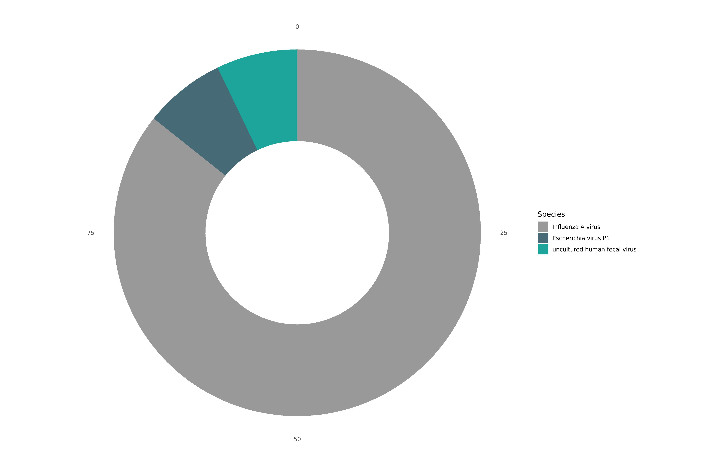

# {{ page.title }}
{: .no_toc }

1. TOC
{:toc}

# What is VAPER?
## Flowchart


## Key Features
VAPER (<ins>V</ins>iral <ins>A</ins>ssembly from <ins>P</ins>robe-based <ins>E</ins>n<ins>r</ins>ichment) is a viral (meta-)assembly pipeline that can:

<div style="padding: 1em; margin: 1em 0;">
🧬 Assemble genomes from complex samples, supporting multiple assemblies per sample (e.g., co-infections)<br>
🧬 Automatically detect and select reference genomes<br>
🧬 Predict the taxonomy of each assembly, with an optional viral metagenomic summary<br>
🧬 Export reads associated with each assembly for downstream use<br>
</div>

While VAPER was originally designed for hybrid capture data, it has also been used with shotgun metagenomic and tile-amplicon data. It comes stock with a comprehensive reference set for <span id="taxon-count">[loading]</span> viral taxa, including **all species targeted by the [Illumina VSP v2.0 panel](https://www.illumina.com/content/dam/illumina/gcs/assembled-assets/marketing-literature/viral-surveillance-panel-v2-data-sheet-m-gl-02882/viral-surveillance-panel-v2-data-sheet-m-gl-02882.pdf)** (see the full list [here](../../ref_search/)). Keep on reading to learn more!

## Contributors
VAPER was originally created by the Washington State Department of Health (WA DOH) as part of the Pathogen Genomics Center of Excellence (PGCoE). Check out the links below to learn more:
- [VAPER developers](https://github.com/DOH-JDJ0303/vaper/graphs/contributors)
- [Other contributors](https://github.com/DOH-JDJ0303/vaper?tab=readme-ov-file#acknowledgements)
- [NW PGCoE](https://nwpage.org/)

---

# Inputs
## Read Downsampling
Reads can be optionally downsampled using the `--max_reads` parameter (default `2_000_000`). This is accomplished using [seqtk][https://github.com/lh3/seqtk] and is primarily intended to control workflow efficiency. That said, this improved *efficiency* comes with a potential loss *sensitivity*, particularly during the reference selection stage. If you anticipate your target organism is present in a sample at low relative read depth, it is recommended that you use `--ref_mode sensitive`, which increases `max_reads` to 2 trillion reads (among other things).

## Human Read Scrubbing
Human reads can be optionally removed using the `--scrub_reads` parameter (default `false`). This is accomplished using the [SRA Human Read Scubber](https://github.com/ncbi/sra-human-scrubber). Scrubbed reads can be found in each sample output directory: `${outdir}/${sample}/reads/`

## Read Quality
Read quality is evaluated and managed using `FastQC` and `fastp`. Fastp metrics are reported in the final summary. FastQC metrics can be found in the `MultiQC` report.

## Downloading Reads from SRA
VAPER can download **paired-end reads** from the NCBI Sequence Read Archive (SRA) (see example below).

`samplesheet.csv`
```csv
sample,sra
sample01,SRR28460430
```

---

# Reference Selection
VAPER can automatically select references for you and/or you can tell VAPER which references to use. Learn more about how to adjust reference selection parameters [here](../inputs/#reference-selection). VAPER comes stock is a default reference set that includes **thousands** of viral species (see the full list [here](../../ref_search/)).

## Automated Reference Selection
VAPER comes with multiple automated reference selection modes: `--refs_mode ( standard | sensitive | kitchen-sink )`. `standard` and `sensitive` modes use a _reference set_ supplied using the `--ref_set` parameter. `kitchen-sink` mode downloads references from NCBI using the metagenomic summary.

{: .note}
Learn more about how reference sets are created [here](../../developers/reference_sets/)

### Reference Selection Modes
> #### **Standard Mode**
> `standard` reference selection mode works as follows:
> 1. A de novo assembly is created using [Shovill](https://github.com/tseemann/shovill)
> 2. Contigs are mapped to the reference set using [Minimap2](https://github.com/lh3/minimap2) (reference filters are applied at this stage - see next section)
> 3. References covered by at least one contig are compared to each other with [Sourmash](https://sourmash.readthedocs.io/en/latest/) and then clustered using DBSCAN and the nucleotide divergence threshold set by `ref_dist`.
> 4. The reference with the greatest sample coverage is selected for each cluster and returned if its genome fraction meets the minimum set by `ref_genfrac`.
>
> |parameter|value|
> |:-|:-|
> |max_reads|2_000_000|
> |ref_genfrac|0.5|
> |ref_denovo_contigcov|10|
> |ref_denovo_contiglen|300|
> |ref_denovo_depth|30|

> #### **Sensitive Mode**
> `sensitive` reference selection uses the same method as `standard` mode but with parameters adjusted to improve the detection of low abundance targets. This increased sensitivity is often met with a large decrease in efficiency (run times may increase dramatically! ⚠️).
>
> |parameter|value|
> |:-|:-|
> |max_reads|2_000_000_000_000|
> |ref_genfrac|0.1|
> |ref_denovo_contigcov|0|
> |ref_denovo_contiglen|0|
> |ref_denovo_depth|1000|

> #### **Kitchen-Sink Mode 🚽**
> `kitchen-sink` mode attempts to build assemblies for each taxon identified in the metagenomic summary. Genome assemblies associated with each taxon are downloaded from NCBI using the NCBI `datasets` tool. Only assemblies that are listed as _complete_ are included and those containing multiple contigs are split into individual FASTA files to avoid concatenating segmented viruses. As you can imagine, this method of reference selection can be very unreliable and should therefore be used with caution ⚠️.

{: .important}
`accurate` and `fast` reference selection modes used in VAPER v1.0 are now depricated. `standard` mode is like `accurate` mode but with more bells and whistles 🔔.

### Reference Set Filtering
You can specify which references to select from using the `ref_*` filter columns / parameters. These filters can be set in the samplehseet (applied per sample) or the command line (applied to all samples). Below are examples of each method:

> #### Sample-Level Filters
> The example below shows how you would direct VAPER to only perform reference selection using *Alphainfluenzavirus influenzae* references for `sample01`. This filter would not be applied to `sample02`. You could likewise filter by **taxon**, **segment**, and **reference name** using the `ref_taxon`, `ref_segment`, and `ref_name` columns.
> `samplesheet.csv`:
> ```csv
> sample,fastq_1,fastq_2,ref_species
> sample01,sample01_R1.fq.gz,sample01_R2.fq.gz,Alphainfluenzavirus influenzae
> sample02,sample02_R1.fq.gz,sample02_R2.fq.gz,
> ```

> #### Run-Level Filters
> The example below shows how you would direct VAPER to only perform reference selection using *Alphainfluenzavirus influenzae* references **for all samples on the run**. You could filter by **taxon**, **segment**, or **reference name** using the `--ref_taxon`, `--ref_segment`, or `--ref_name` parameters.
> ```bash
> nextflow run doh-jdj0303/vaper \
>   -r v2.0 \
>   -profile docker \
>   --input samplesheet.csv \
>   --outdir results \
>   --ref_species "Alphainfluenzavirus influenzae"
> ```

{: .important}
The `ref_taxon`, `ref_species`, and `ref_segment` filters control which references are considered during the selection process, whereas references specified by the `ref_name` filters will **always** be included, regardless of if there are reads to create an assembly.

## Manual Reference Selection
References can also be supplied manually as individual file paths with or without an existing reference set. Like the reference set filters, this can be accomplished via the samplesheet (sample level) or the command line (run level). Multiple references can be supplied as a semicolon separated list. See below for examples:

> #### Sample-Level Reference Files
> `samplesheet.csv`:
> ```csv
> sample,fastq_1,fastq_2,ref_file
> sample01,sample01_R1.fq.gz,sample01_R2.fq.gz,/path/to/reference.fa.gz
> sample02,sample02_R1.fq.gz,sample02_R2.fq.gz,
> ```

> #### Run-Level Reference Files
> ```bash
> nextflow run doh-jdj0303/vaper \
>   -r v2.0 \
>   -profile docker \
>   --input samplesheet.csv \
>   --outdir results \
>   --ref_file /path/to/reference.fa.gz
> ```

---

# Genome Assembly
VAPER creates genome assemblies by aligning reads to one or more reference and calling the consensus at each reference position. This is accomplished using [BWA MEM](https://github.com/lh3/bwa), [Samtools](https://www.htslib.org/doc/samtools-mpileup.html), and [iVar](https://andersen-lab.github.io/ivar/html/index.html).

{: .important}
VAPER v2.0 does not support the CDC IRMA assembler.

{: .note}
Learn more about how to adjust assembly parameters [here](../inputs/#assembly-options).

## Assembly Modes
VAPER comes with several default assembly modes. These modes primarily differ in how they handle reference positions with mixed read support. 

> #### **Standard Mode**
> `standard` mode assembles the dominant viral population in sample, ignoring minor allele variation introduced by subpopulations. At least 60% of the reads must support a single nucleotide to make a call.
>
> |parameter|value|
> |:-|:-|
> |cons_allele_qual|20|
> |cons_allele_ratio|0.6|
> |cons_allele_depth|10|
> |cons_max_depth|100|

> #### **Strict Mode**
> `strict` does the same thing as `standard` mode but requires that at least 90% of the reads support the same nucleotide to make a call.
>
> |parameter|value|
> |:-|:-|
> |cons_allele_qual|20|
> |cons_allele_ratio|0.9|
> |cons_allele_depth|10|
> |cons_max_depth|100|

> #### **Mixed Mode**
> `mixed` mode includes minor allele varation in the form of mixed IUPAC codes. This mode can be useful for environmental or pooled samples. The minimum and maximum read depth parameters are increased to account for multiple nucleotide calls at each position.
>
> |parameter|value|
> |:-|:-|
> |cons_allele_qual|20|
> |cons_allele_ratio|0.2|
> |cons_allele_depth|20|
> |cons_max_depth|200|

{: .tip}
You can remove terminal Ns from each assembly using `--cons_prune_termini`. This is required when submitting some viral species to NCBI.

## Assembly Quality
Assembly quality is evaluated using a custom script, `vaper_stats.py`. Quality metrics are reported relative to the reference genome used to create the assembly. Assemblies are automatically classified as `PASS` or `FAIL` based on the QC thresholds set using the `--qc_depth` and `--qc_genfrac` parameters. 

{: .note}
Assemblies will still be saved if they fail QC!

## *Condensing* Duplicate Assemblies
VAPER will occasionally produce multiple, *near*-identical assemblies (often >99.9% identity). This generally occurs when fragmented contigs from the de novo assembly map to multiple, closely related references. These assemblies are identified using a simple clustering approach (Sourmash + DBSCAN) and the minimum distance set by `--cons_condist`. Only the _best_ assembly is returned, based on read coverage × depth.

---

# Metagenomic Classification
VAPER performs an optional viral _metagenomic_ analysis using `sourmash gather` and `sourmash tax metagenome` with the [21-mer viral NCBI database (Jan 2025)](https://sourmash.readthedocs.io/en/latest/databases-md/ncbi_viruses_2025_01.html). You can skip the metagenomic analysis using `--metagenome false` or supply alternative database files using `--sm_db` and `--sm_taxa`.

{: .note}
The static image and summary exclude unclassified sequences when calculating relative abundance. Sequences with relative abundance ≤ 1% are grouped into `Other`.

## Example Outputs
Below are examples of the metagenomic output for a Twist Bioscience synthetic RNA control for Influenza A H1N1.
### Krona Plot

Explore the interactive plot [here](../../../media/metagenomics.krona_example.html).

### Static Image


### VAPER Summary

|SPECIES_SUMMARY|
|:-|
|91.2% Influenza A virus; 6.4% Escherichia virus P1; 6.4% uncultured human fecal virus|

<script>
  fetch(`../../ref_search/data/taxon_jsons/taxon_list.json`)
    .then(response => response.json())
    .then(data => {
      const count = data.length;
      document.getElementById('taxon-count').textContent = count;
    })
    .catch(() => {
      document.getElementById('taxon-count').textContent = '`[Error getting count]`';
    });
</script>


